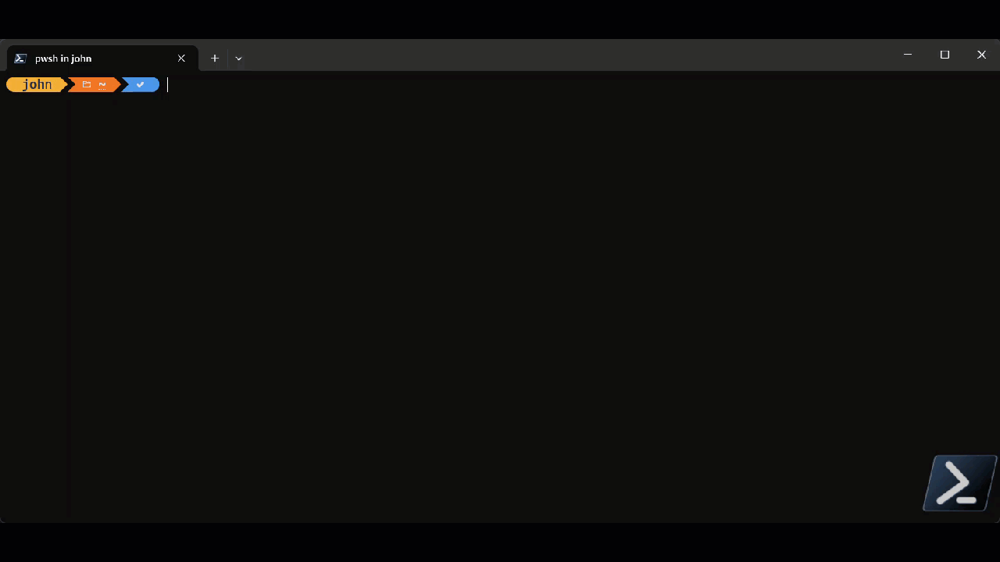

# JWK(S) Builder and validator .NET Global Tool

## Overview
JWKS Tools is a .NET global tool that helps build individual JWK, JWKS file from either a single binary ceritificate or a directory of multiple certificate files. It can also be used to verify a JWKS agains a directory of certificate files to verify if there is a discrepency.

## Installation
```
dotnet tool install --global jwkstools
```


### Usage Demo


## Commands
There are currently three commands in this tool. asd

- **buildjwk** - This command take a certificate and then builds a JWK file from the certificate. Options for command are listed in the table below.
- **buildjwks** - This command takes a directory of one of more certificates and will build a JWKS file with each cert in the keys elements of the file. Options for command are listed in the table below.
- **verifyJWKS** - This command takes a directory with one or more certificates and a JWKS file. It will compare each certificate with whats in the JWKS and report out matches. You can also choose to create a new JWKS file based on the output. Options for command are listed in the table below.


### buildjwk Command

Below are the arguments and options that can be used with the buildjwk command.

|Name|Type|Position|Description|Values|Default|
| --- | --- | --- | --- | --- | --- |
| n/a | Command Argument | 0 | name (and full path if needed) of a certificate | n/a | n/a |
| n/a | Command Argument | 1 | name (and full path if needed) the output file |n/a | n/a |
| --display | Option | n/a | Output JWK to the console | n/a | n/a |
| --overwrite | Option | n/a | Overwrite JWK output file if it exists | n/a | n/a |
| --hash | Option | n/a | Define what KID hash algorithm should be used | sha1, sha256, md5 | sha1 |
| --help | Option | n/a | Get help for the command |  |  |

### Examples
```
jwkstools buildjwk c:\cert\testcert.crt c:\jwkfiles\testcert.jwk --hash sha256

jwkstools buildjwk c:\cert\testcert.crt c:\jwkfiles\testcert.jwk
--display --sha1

jwkstools buildjwk c:\cert\testcert.crt c:\jwkfiles\testcert.jwk --hash sha256 --overwrite
```

### buildjwks Command

Below are the arguments and options that can be used with the buildjwks command.

|Name|Type|Position|Description|Values|Default|
| --- | --- | --- | --- | --- | --- |
| n/a | Command Argument | 0 | Path of a directory that contains one or more certificates | n/a | n/a |
| n/a | Command Argument | 1 | name (and full path if needed) the output JWKS file |n/a | n/a |
| --display | Option | n/a | Output JWK to the console | n/a | n/a |
| --overwrite | Option | n/a | Overwrite JWK output file if it exists | n/a | n/a |
| --hash | Option | n/a | Define what KID hash algorithm should be used | sha1, sha256, md5 | sha1 |
| --help | Option | n/a | Get help for the command |  |  |

### Examples
```
jwkstools buildjwks c:\cert\testcert.crt c:\jwkfiles\testcert.jwk --hash sha256

jwkstools buildjwks c:\certs\ c:\jwkfiles\testcert.jwk
--display --sha1

jwkstools buildjwks c:\cert\testcert.crt c:\jwkfiles\testcert.jwk --hash sha256 --overwrite
```

### verifyjwks Command

Below are the arguments and options that can be used with the verifyjwks command.

|Name|Type|Position|Description|Values|Default|
| --- | --- | --- | --- | --- | --- |
| n/a | Command Argument | 0 | Path of a directory that contains one or more certificates | n/a | n/a |
| n/a | Command Argument | 1 | Path and filename of the JWKS file to verify |n/a | n/a |
| --createnew | Option | n/a | Create a new jwks file that is date stamped (in the local where the tool was run) | n/a | n/a |
| --hash | Option | n/a | Define what KID hash algorithm should be used | sha1, sha256, md5 | sha1 |
| --help | Option | n/a | Get help for the command |  |  |

### Examples
```
jwkstools verifyjwks c:\certs\ c:\jwkfiles\newfile.jwks

jwkstools verifyjwks c:\certs\ c:\jwkfiles\newfile.jwks --hash sha1

jwkstools verifyjwks c:\certs\ c:\jwkfiles\newfile.jwks --createnew --hash sha256 --overwrite
```

## More Information

- Issues: Please file issues on github so we can followup and track.
- Contact: Please use github for any communication
- Pull request are welcome. If you would like to add something, feel free to create a pull request and I'll review
